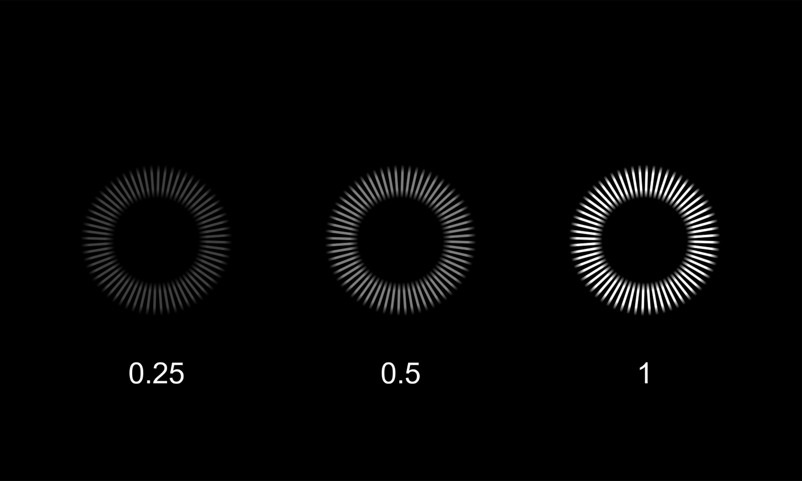

# 2.4 - Color, Opacity

`Bar Color`: Sets the base color for all bars.
> ⚠️ Must be in RGB format: ($\color{red}{\text{Red}}$, $\color{green}{\text{Green}}$, $\color{blue}{\text{Blue}}$)

Useful websites: 
+ [Google's Color Picker](https://www.google.com/search?q=color+picker)
+ [HTML Color Codes](https://htmlcolorcodes.com/)
+ [Image Color Picker](https://imagecolorpicker.com/)

  
`Opacity`: Controls the transparency of all bars. 1 is fully visible, 0 is invisible.

