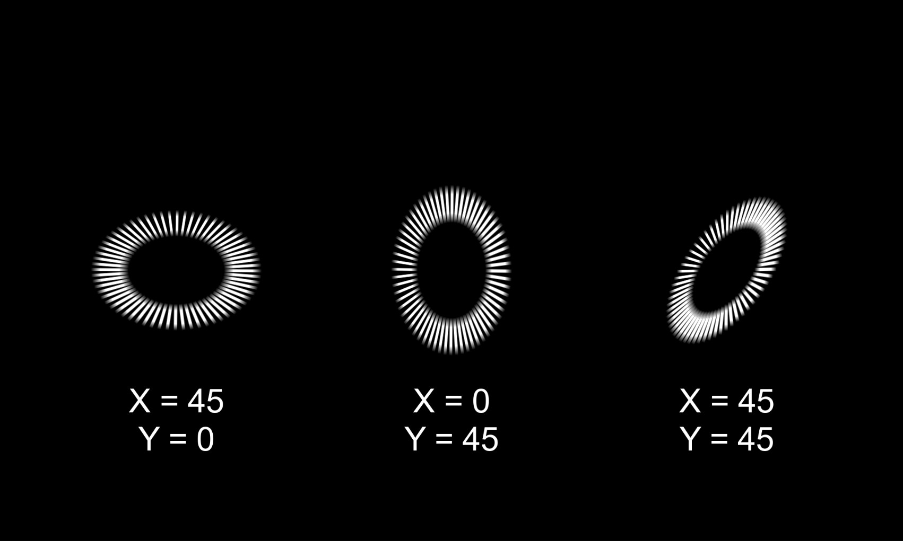
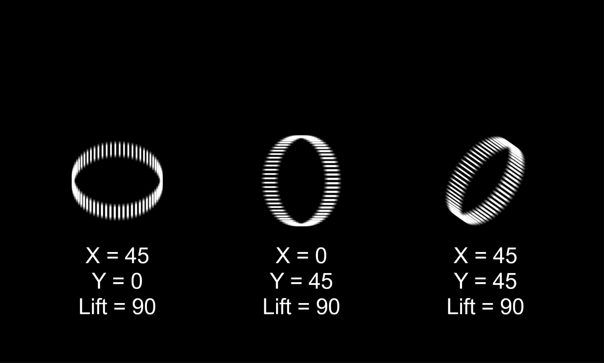
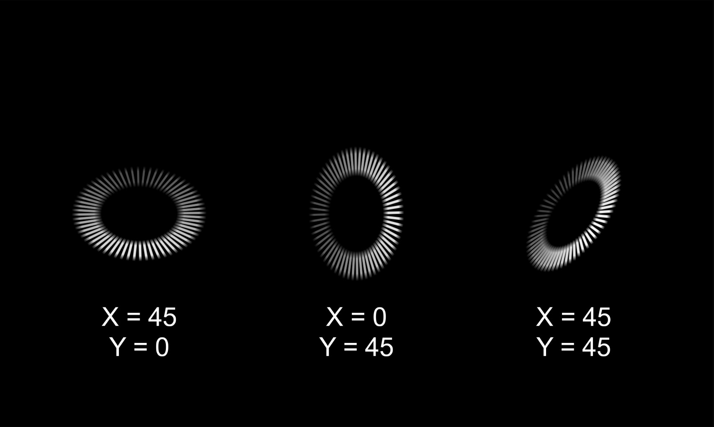

# 2.5 - 3D Simulation

`3D Rotation X / Y`: Tilts the entire visualizer in 3D space.
+ `X` tilts it "back and forth".
+ `Y` tilts it "left and right".

   
`Lift Angle`: This "lifts" the bars off the circle's flat plane.

   
`Enable Perspective`: Make parts of the circle that are "closer" appear larger, enhancing the 3D effect.

`Perspective`: Controls the "depth" of the 3D effect. Lower values are more extreme.

`Enable Depth Alpha`: Makes bars that are "further away" (due to rotation) more transparent.

`Depth Alpha Strength`: Controls how much they fade.

