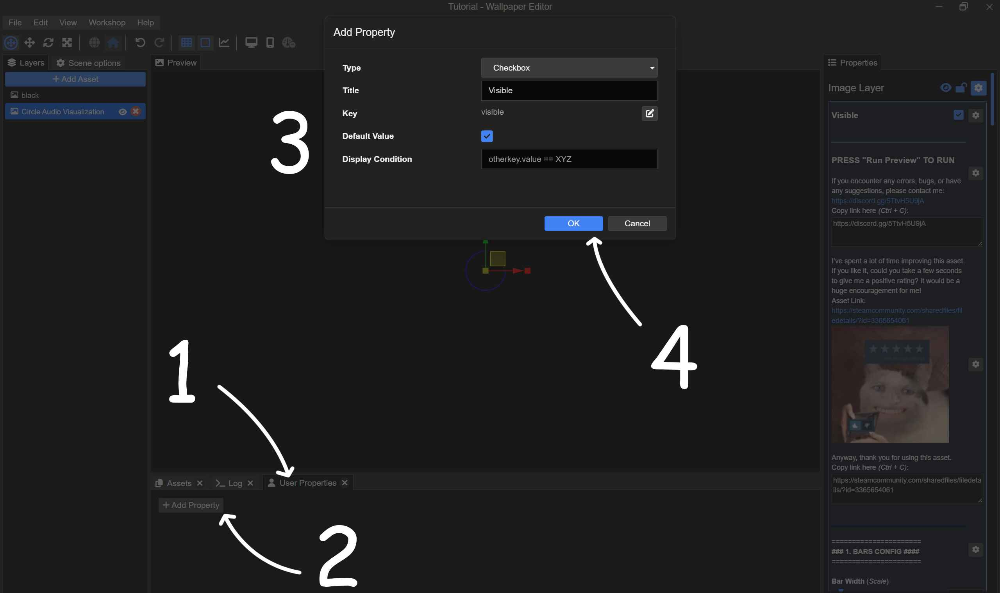
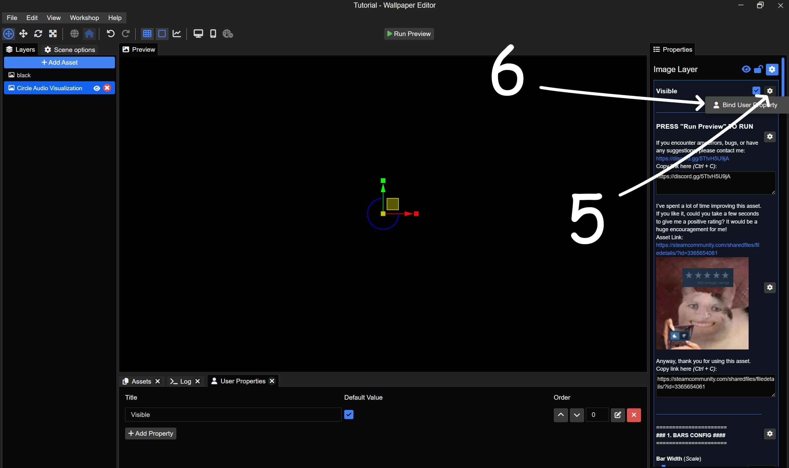
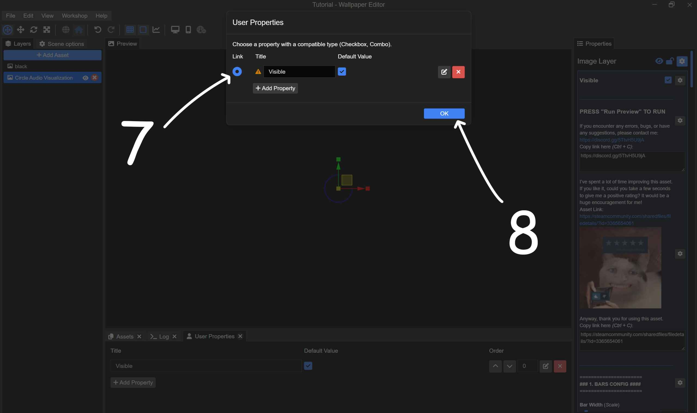
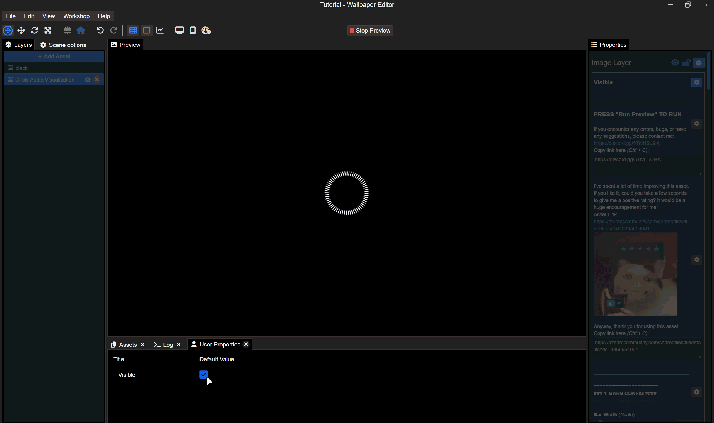
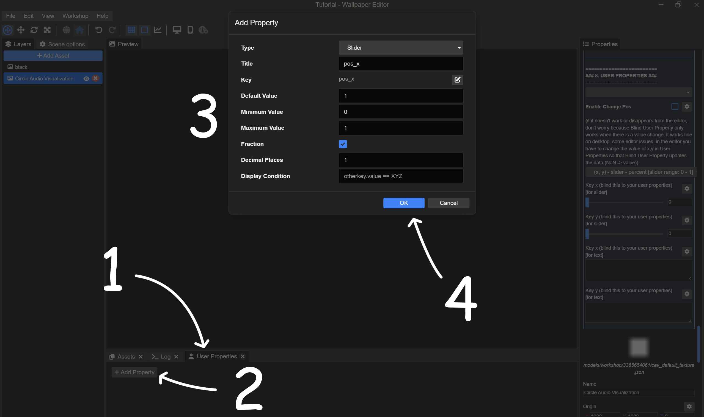
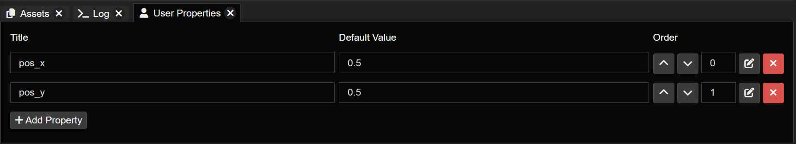
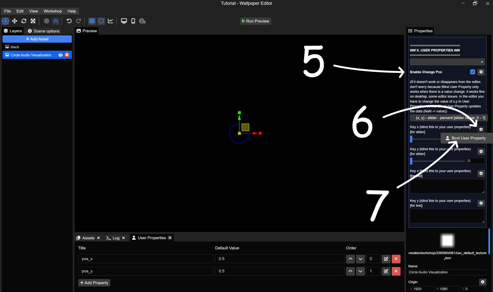
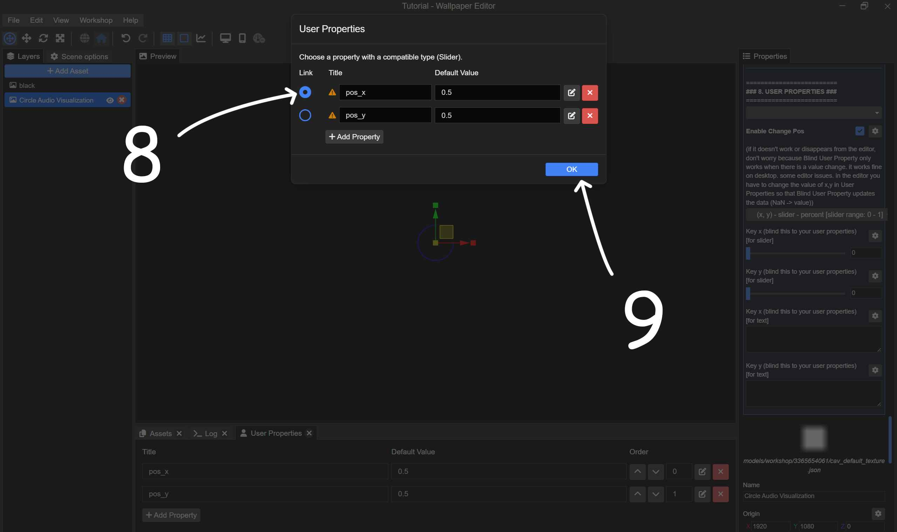
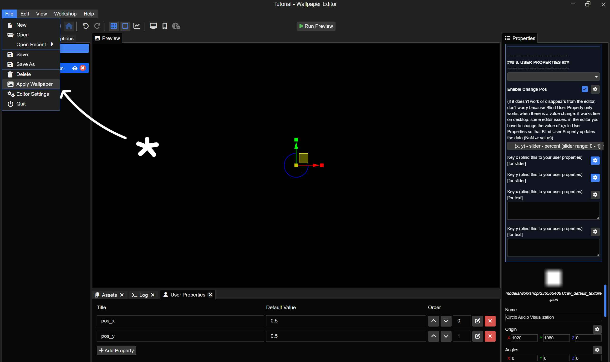
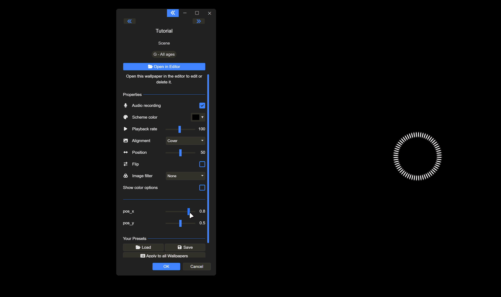

# 2.8 - User Properties

## 1. Basic Binding

The 'Bind' function lets the User access and modify properties without having to open the editor.

**References:**
+ [(Youtube) Wallpaper Engine - Creating custom user properties](https://youtu.be/6Y-RGJmKDE8?si=zoY_Kd95L1nGv6d7)
+ [(Wallpaper Engine Documentation) User Properties | Wallpaper Engine - Designer Documentation](https://docs.wallpaperengine.io/en/web/customization/properties.html)

  
**Simple example:** Allowing the user to change the `Visible` property.

   

   

   

### Result

   

## 2. Change Visualizer Position

- `Slider - Percent` value range: [0, 1]

- `Slider - Value` value range: your scene resolution

- `Text - Value` value range: your scene resolution

### Guide for Slider - Percent
Add two properties to `User Properties`.
1. Go to `User Properties`.
2. Select Add Property.
3. 
   + Type: Slider
   + Title: <(Provide a name)>
   + Key: <(It automatically uses the title, or you can adjust it yourself)> (Avoid special identifiers like 'x' or 'y' to prevent errors).
   + Min/Max Value range [0, 1]
4. Select Ok

   
Do the same to add the other one.

   
Tick `Enable Change Pos`, then proceed with 'blind'.

   
Since I am binding for `X`, I will select `pos_x`. Continue doing the same for `Y` to bind both into the two properties we just created in `User Properties`.

   
It might not work correctly in the editor. Therefore, I will apply the wallpaper and check it on the desktop screen.

   

### Result

