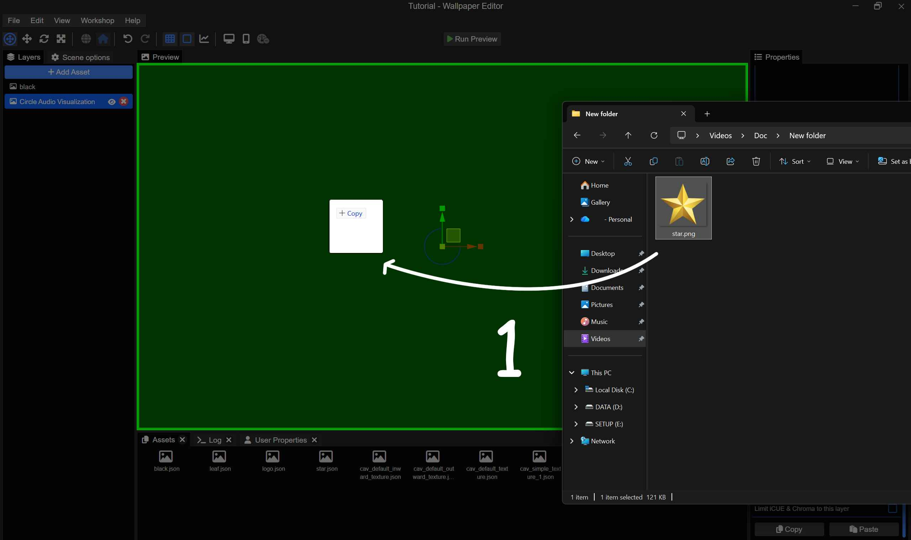
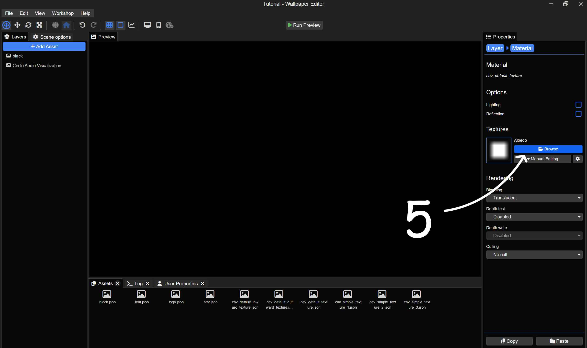
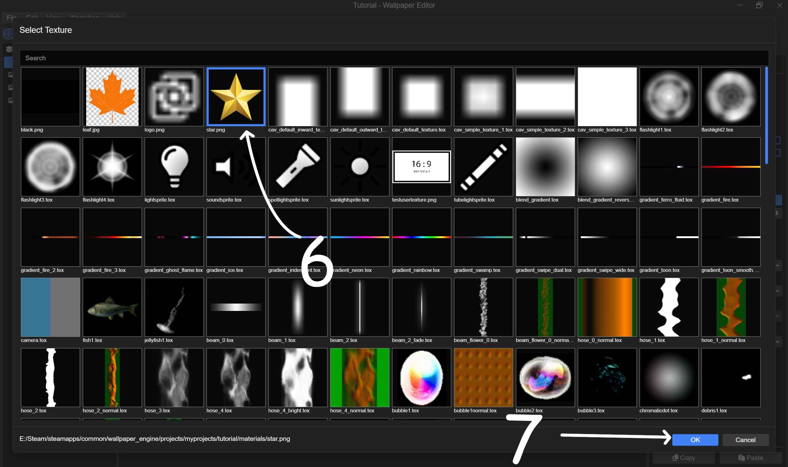
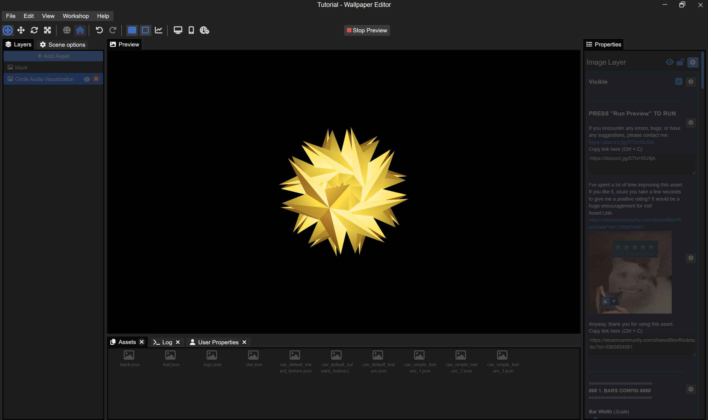
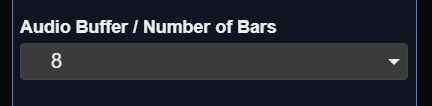
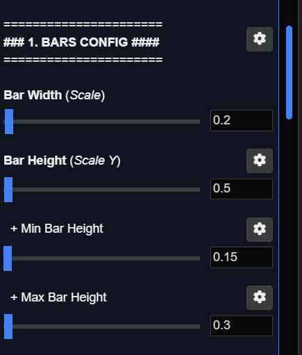
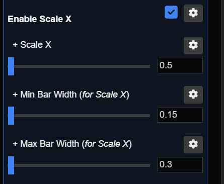

# 2.9 - Change Material

1. Drag and drop your image into the Wallpaper Engine editor.

   

2. Delete the unused layer (the layer automatically added by Wallpaper Engine).

3. Re-select the asset, then scroll all the way down to the Materials section.

4. Click on the texture preview box.

   

5. Select `Browse`.

   

6. Select `your image`.

7. Select `Ok`.

   

  
With the default settings, it doesn't look good... so we need to change the settings.

There are too many bars, so I will decrease the number (64 -> 8).

   
Also, I reduce the parameter to a reasonable value so it becomes smaller.

   
Since that image is a square, I need it to stretch across both height and width. Therefore, I will enable Scale X and adjust its value to a reasonable amount.

   
### And this is the final result!

   
