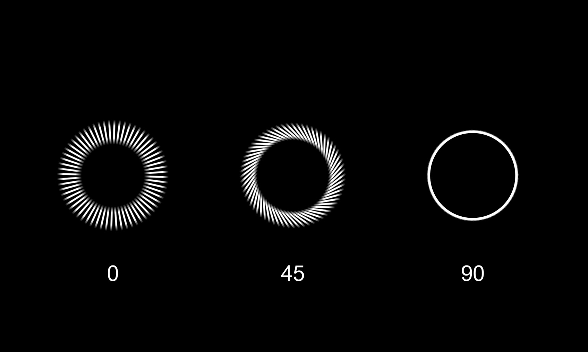
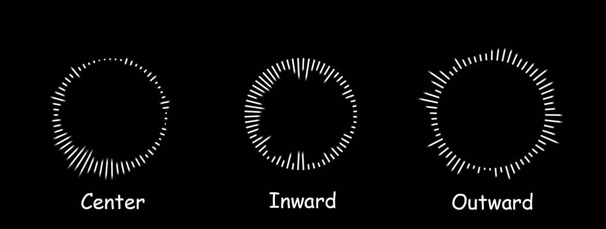
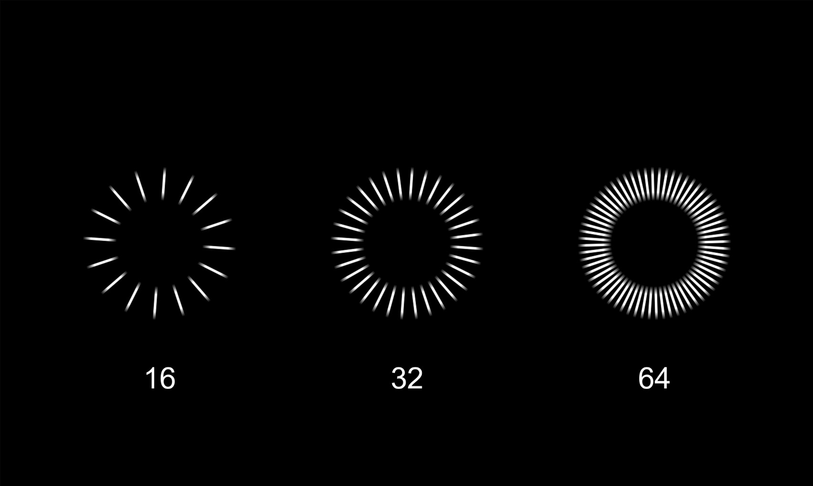
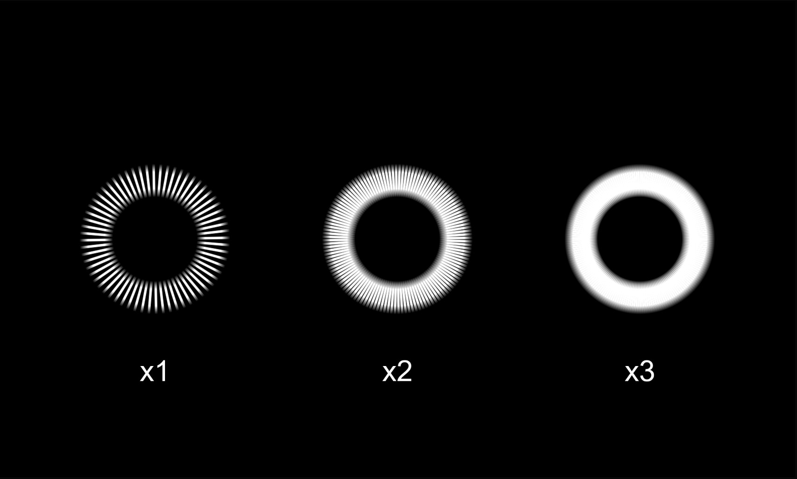

# 2.1 - Bar Config

`Bar Width`: Controls the thickness of all bars.

`Bar Height`: The main multiplier for bar height. Higher values make the bars react more strongly to music.

`Min / Max Bar Height`: These clamp the bar height.
+ `Min Bar Height` is great for making the visualizer visible even when music is very quiet/off.
+ `Max Bar Height` prevents the bars from getting excessively long with loud music.

`Enable Scale X`: Check this to make bars get **wider** as they get **taller**.

`Bar Angle Offset`: Tilts each individual bar. At 0, bars point straight out. At 90, they will lie flat along the circle's edge.

   
`Bar Alignment`: This setting controls where the bar "grows" from.
+ `Center`: The bar grows in both directions from the circle's line *(default)*.
+ `Inward`: The bar grows into the circle.
+ `Outward`: The bar grows out of the circle.

> ⚠️ *(If you change this setting, you MUST change the material to match)*

   
`Audio Buffer / Number of Bars`: This is the base number of audio frequencies the visualizer will react to.

   
`Multiplier Bars`: Creates copies of the base bars to make the circle look fuller.

